# From relu to gelu
## 激活函数的特性 

[从ReLU到GELU，一文概览神经网络的激活函数](https://zhuanlan.zhihu.com/p/98863801) 

| 激活函数名 | sigmoid                 | relu                 | elu                 | leaky relu            | selu                                    | gelu                 |
|------------|-------------------------|----------------------|---------------------|-----------------------|-----------------------------------------|----------------------|
| 函数公式   | 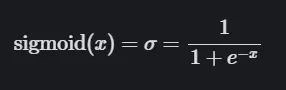   | 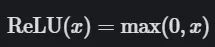   | 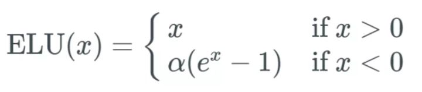   | 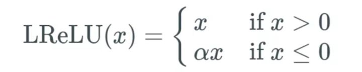   | 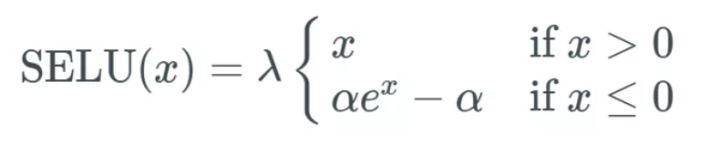 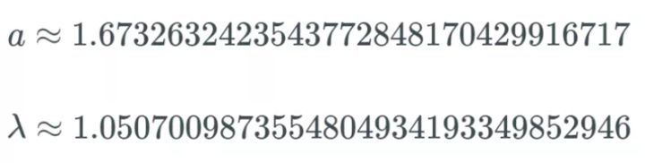 | 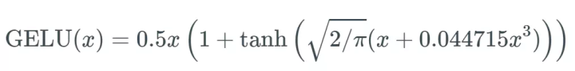   |
| 函数图像   |     | 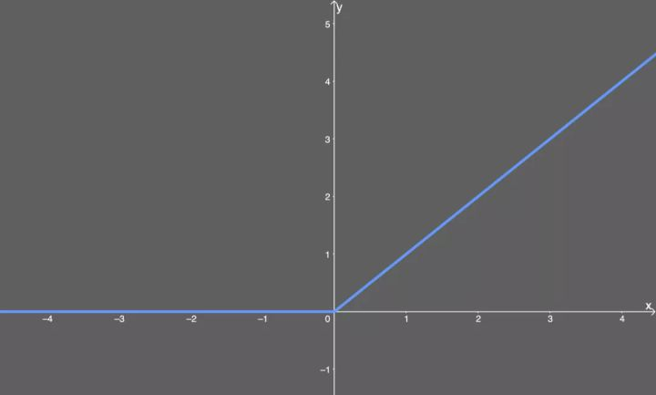    | 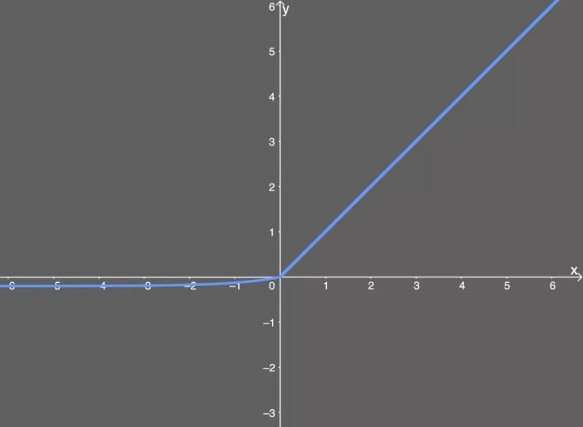    | 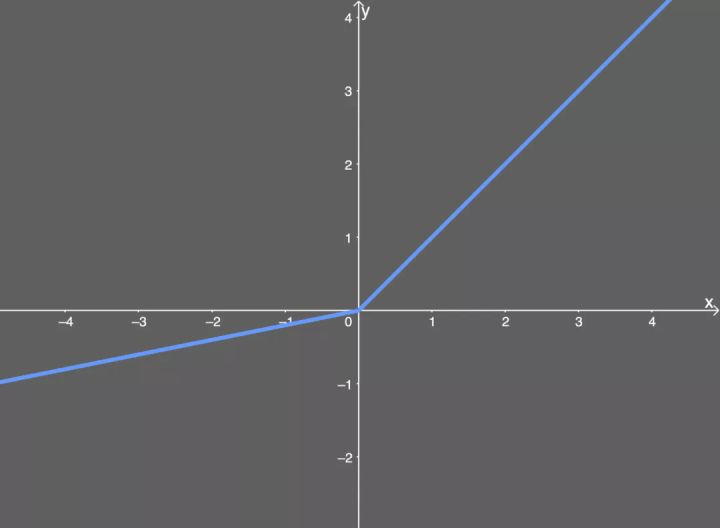    | 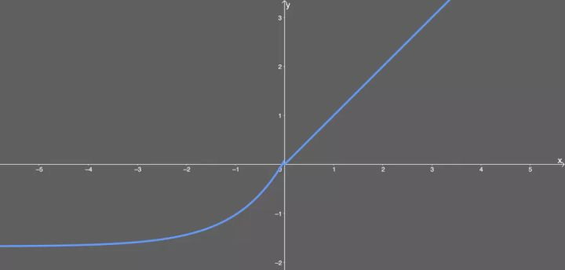                       | 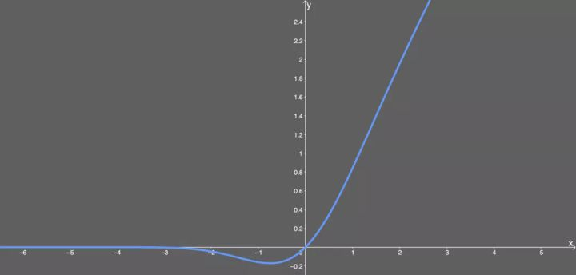    |
| 函数导数   | 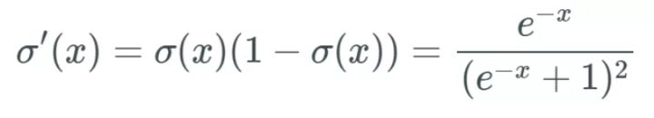 | 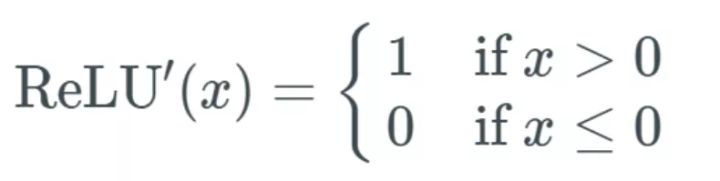 | 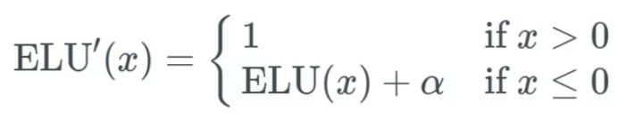 | 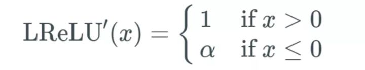 | 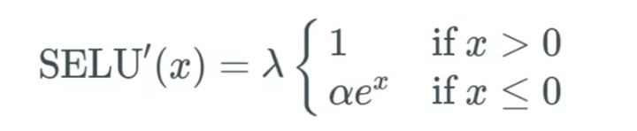                    | 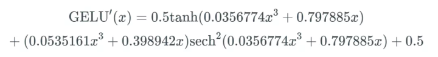 |
| 导数图像   | 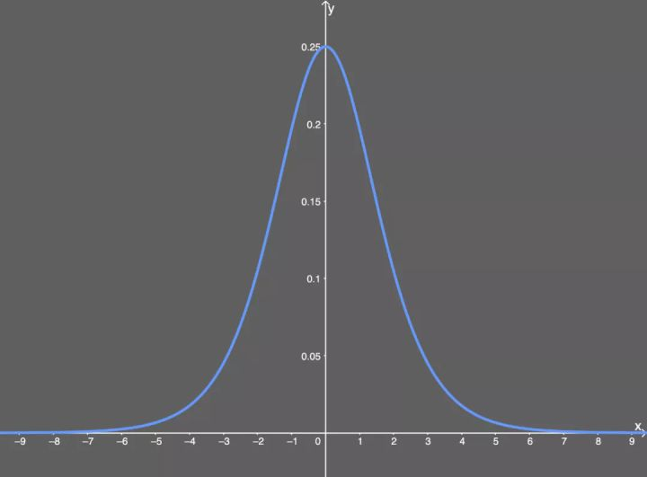  | 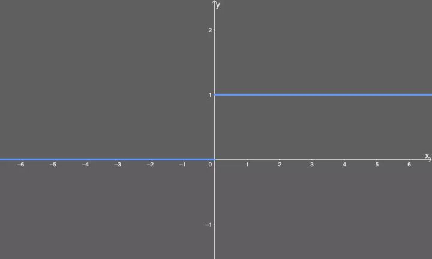  | 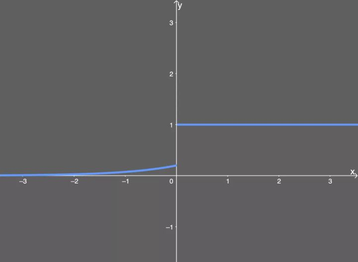  | 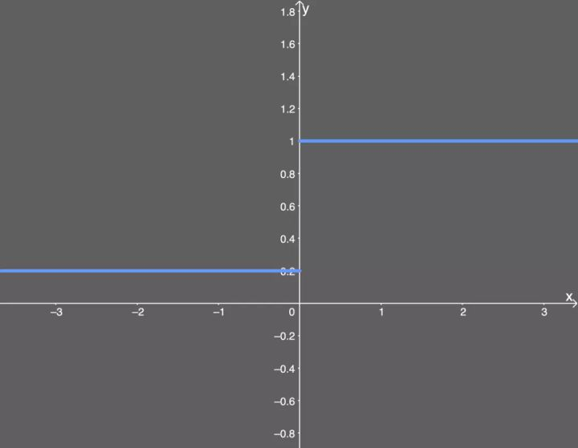  | 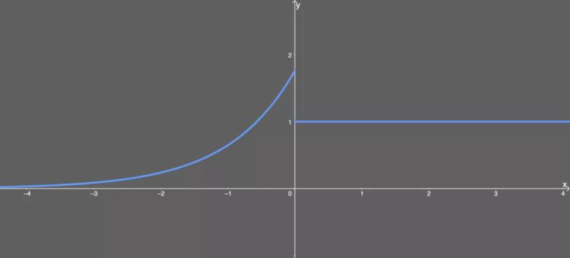                     | 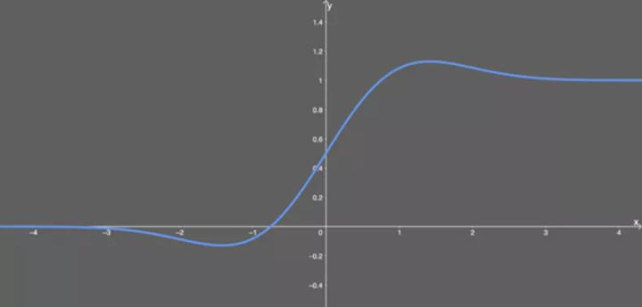  |
| 优点       |                         |                      |                     |                       |                                         |                      |
| 缺点       |                         |                      |                     |                       |                                         |                      |

